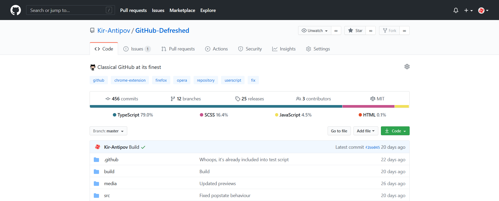
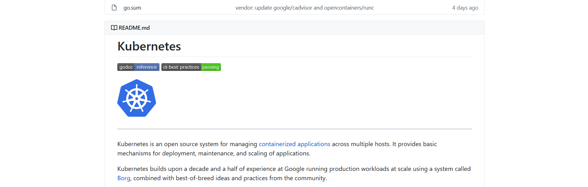

<p align="center">
  
</p>
<h2 align="center">&nbsp;:star:&nbsp;this repo to&nbsp;:-1:&nbsp;repository page update</h2>

## About

So, Microsoft took yet another step to prove to some last doubters that **Microsoft is the worst thing that happened to GitHub ever**. 

This time effective managers from Microsoft (tbh, I don't think there were any UI/UX designers involved into this) turned repository page into some unusable low quality piece of :shit:.

But don’t worry! Seeing this update in preview, I was horrified and began to ~~build a nuclear junker~~ develop a script that will roll back all changes, since I reasonably suspected that Microsoft would give a heck about all the negative feedback. So, here we are: 

## Preview




Just ol' buddy GitHub in person

## Installation

🐵 Install [Greasemonkey](https://www.greasespot.net/), [Tampermonkey](https://www.tampermonkey.net/) or any other browser extension that supports an execution of user scripts and then

📦 [Install the user script](https://raw.githubusercontent.com/Kir-Antipov/GitHub-Defreshed/master/build/github-defreshed.user.js) which supports automatic updates and customization.

## Build

```
git clone https://github.com/Kir-Antipov/GitHub-Defreshed.git
cd GitHub-Defreshed

npm install
npm run build
```

## Why new "design" sucks

If you're not using GitHub (then what are you doing here?), new "design" from the outside may seem nice enough to you, but let's look at it from the point of view of the person who uses it:

 - We don't see last commit message anymore
 - We can't see the language bar anymore without scrolling page down in most repos
 - "About" section, topics and so on were moved to the right sidebar - directly out of our point of attention
 - On the contrary, readme was moved to the left side - directly out of our point of attention again
 - Readme container has been enlarged, but its content still fits into same dimensions, so the feeling of wasted space will not leave you while you read it
 - Repository tabs are no longer felt as part of the repo

And another 1000 and 1 reason.

## Why "new design sucks" isn't subjective

Design is an extremely subjective thing, so you can say that Microsoft should not be judged strictly, but not this time, 'cause there's one simple and very objective criterion in design - information accessibility.

Previously, to understand everything about some repo, it was enough for me to take just one look at it: name, description, languages in use, releases' count, contributors, website, last commit - all this stuff was in one place exactly in my point of attention. And now...


Well, I believe, you've got the point.