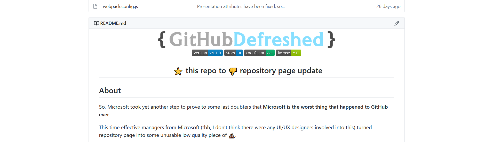
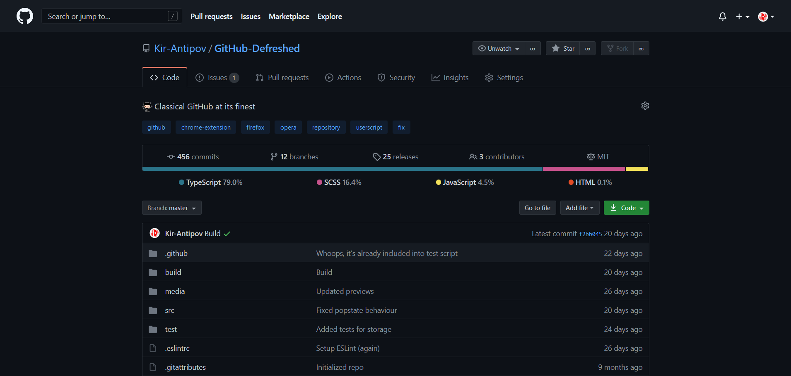

<p align="center">
  
  <br>
  <a href="https://github.com/Kir-Antipov/GitHub-Defreshed/tags"></a>
  <a href="https://github.com/Kir-Antipov/GitHub-Defreshed/stargazers"></a>
  <a href="https://www.codefactor.io/repository/github/kir-antipov/github-defreshed/overview"></a>
  <a href="https://raw.githubusercontent.com/Kir-Antipov/GitHub-Defreshed/master/LICENSE.md"></a>
</p>
<h2 align="center">&nbsp;:star:&nbsp;this repo to&nbsp;:-1:&nbsp;repository page update</h2>

## About

So, Microsoft took yet another step to prove to some last doubters that **Microsoft is the worst thing that happened to GitHub ever**.

This time effective managers from Microsoft (tbh, I don't think there were any UI/UX designers involved into this) turned repository page into some unusable low quality piece of :shit:.


## Preview

Repository page (`Default light`):




Profile page (`Default light`):


Repository page (`Default light` + `Enable light header`):


Repository page (`Default dark`):



Repository page (`Dark dimmed`):


Just ol' buddy GitHub in person

## Installation

### Firefox

🦊 Install [Firefox add-on](https://addons.mozilla.org/firefox/addon/github-defreshed/).

### Google Chrome

📦 Install [Chrome extension](https://chrome.google.com/webstore/detail/github-defreshed/gdemlbajmchlbdfocbndaimmoiaocegp).

### Opera

🔧 Install [Opera add-on](https://addons.opera.com/en/extensions/details/install-chrome-extensions/) that adds Chrome extensions support to your browser.

📦 Install [Chrome extension](https://chrome.google.com/webstore/detail/github-defreshed/gdemlbajmchlbdfocbndaimmoiaocegp).

### Any browser <sup><sub><sup>(recommended for the smoothest experience)</sup></sub></sup>

🐵 Install [Greasemonkey](https://www.greasespot.net/), [Tampermonkey](https://www.tampermonkey.net/) or any other browser extension that supports an execution of user scripts and then

📦 [Install the user script](https://github.com/Kir-Antipov/GitHub-Defreshed/releases/latest/download/github-defreshed.user.js) which supports automatic updates and customization.

## Bleeding-edge builds

If you don't want to wait for a new version to be released, you can always get your hands on the latest bleeding-edge changes for testing, so take a look at the automated builds produced through  [GitHub Actions workflow](https://github.com/Kir-Antipov/GitHub-Defreshed/actions/workflows/ci.yml?query=event%3Apush). This workflow automatically runs every time a change is pushed to the repository, and as such, the builds it produces will generally reflect the latest snapshot of development.

## Features

 - Old style header
 - Light header
 - Prettified `About` and `Summary` sections
 - Prettified README
 - Unhidden commit message
 - Unhidden user status
 - `Stars`, `Followers` and `Following` tabs are back
 - Unrounded buttons, avatars and containers
 - Full support of custom themes (e.g., `GitHub-Dark`)
 - Full support of default themes (`Default light`, `Default dark` and `Dark dimmed`)
 - Partial support of other scripts and extensions (e.g., `Refined GitHub`). Partial, since none of developers (including myself) can be sure that their extension is compatible with every plugin with unknown functionality in the world
 - And much more!

## Settings

Some features of the script are optional. You can customize behavior of the `GitHub-Defreshed` using the web extension popup or on the [profile settings page](https://github.com/settings/profile):


## Build

```
git clone https://github.com/Kir-Antipov/GitHub-Defreshed.git
cd GitHub-Defreshed

npm install
npm run build
```

## Why new "design" sucks

If you're not using GitHub (then what are you doing here?), new "design" from the outside may seem nice enough to you, but let's look at it from the point of view of the person who uses it:

 - We don't see last commit message anymore
 - We can't see the language bar anymore without scrolling page down in most repos
 - "About" section, topics and so on were moved to the right sidebar - directly out of our point of attention
 - On the contrary, readme was moved to the left side - again, directly out of our point of attention
 - Readme container has been enlarged, but its content still fits into same dimensions, so the feeling of wasted space will not leave you while you read it
 - Repository tabs are no longer felt as part of the repo

And thousands of other reasons.

## Why "new design sucks" isn't subjective

Design is an extremely subjective thing, so you can say that Microsoft should not be judged strictly, but not this time, 'cause there's one simple and very objective criterion in design - information accessibility.

Previously, to understand everything about some repo, it was enough for me to take just one look at it: name, description, languages in use, releases' count, contributors, website, last commit - all this stuff was in one place exactly in my point of attention. And now...


Well, I believe, you've got the point.